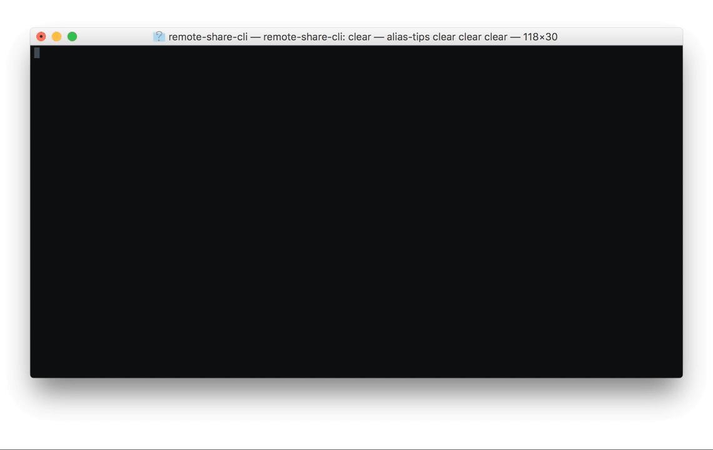

> Quickly share files from command line to the world



# remote-share-cli

* :rocket: Dead Simple
* :sparkles: Just works
* :earth_africa: Globally accessible

remote-share-cli exposes single files to the internet via https, either from stdin or a given file.
The exposing address is copied to your clipboard automatically.

Afer a complete download or 5 minutes of inactivity remote-share-cli closes automatically.

## Installation

```
npm install -g remote-share-cli
```

## Usage

```
❯ remote-share --help

  Quickly share files from command line to the world

  Usage
  	$ remote-share [file]

  Options
  	-n, --name Forced download name of the file

  Examples
  	$ remote-share shared.png
  	https://unequal-wish.localtunnel.me

  	$ cat shared.png | remote-share --name=shared.png
  	https://important-downtown.localtunnel.me
```

## Related projects

*  [share-cli](https://github.com/marionebl/share-cli) - Quickly share files from command line to your local network

---
remote-share-cli is built by [Mario Nebl](https://github.com/marionebl) and released
under the [MIT](./license.md) license.
